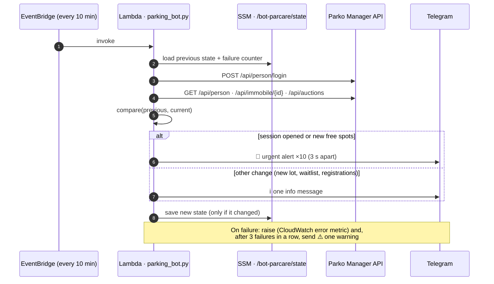
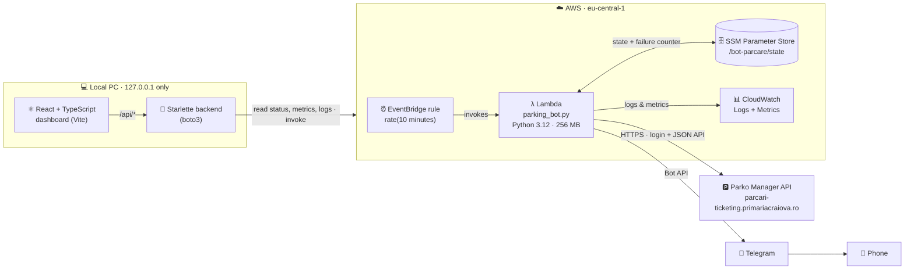

# 🅿️ Craiova Parking Bot


A serverless bot that watches the **Craiova residential parking portal** (*Parko Manager*, run by Craiova City Hall) and sends a **Telegram alert the moment a submission session opens or a parking spot near your residence becomes free**. It comes with a **local monitoring dashboard** (React + TypeScript + Starlette) that shows the bot's health, activity metrics and logs, and can send test alerts.

- ⏱️ Checks the site every **10 minutes**, 24/7, on AWS Lambda. Each check takes about 1 second.
- 🎯 Uses the portal's **own JSON API and its own rules** for what "free" and "session open" mean, so there are no false positives from screen scraping.
- 🔔 **Urgent alerts repeat 10 times** so they can't be missed, and list the exact spot numbers.
- 🛡️ **Fails loudly:** if the bot can't log in or read the site for 30 minutes, you get a Telegram warning, and another one when it recovers.
- 🔒 **Privacy by design:** alerts never contain your address or IDs, secrets are never committed, and the dashboard has a privacy mode for screenshots.
- 💶 Runs **within the AWS free tier** (about $0/month).

> **Disclaimer:** an unofficial, personal project with no affiliation to Craiova City Hall. It uses your own account on the portal, reads only what that account can see, and polls at a gentle 10-minute interval.

---

## Table of contents

- [How it works](#how-it-works)
- [Architecture](#architecture)
- [Design decisions](#design-decisions)
- [Tech stack](#tech-stack)
- [Repository structure](#repository-structure)
- [Installation](#installation)
- [Local dashboard](#local-dashboard)
- [Configuration](#configuration)
- [Alerts](#alerts)
- [Security & privacy](#security--privacy)
- [Costs](#costs)
- [Project history](#project-history)
- [Limitations](#limitations)

---

## How it works

Residential parking spots in Craiova are allocated through **submission sessions** on the city's portal. Sessions open at unpredictable times, and spots near a given building appear and disappear. Missing the window means waiting for the next session.

The portal is a single-page React app backed by a JSON API. The bot talks to that API directly, the same way the website does:

| Step | Request | Purpose |
|---|---|---|
| 1 | `POST /api/person/login` | Log in with the account's email + password (session cookie) |
| 2 | `GET /api/person` | Read the residences registered on the account (`address[].ID_IMOBIL`) |
| 3 | `GET /api/immobile/{id}?distance_to_parking_lot=30` | Parking lots within 30 m of each residence, with every spot's state |
| 4 | `GET /api/auctions` | The account's auction registrations and waitlist entries |

It then applies **the exact rules the website uses to colour the map**:

- a spot is **free** when `availability == "free"` **and** `status == "active"` (green on the map)
- a lot's **submission session is open** when `can_apply_for_auction == true`

The result is compared with the previous state saved in **AWS SSM Parameter Store**, and the bot sends alerts only for what changed:



## Architecture



| Component | Responsibility |
|---|---|
| **EventBridge rule** `bot-parcare-trigger` | Invokes the Lambda every 10 minutes |
| **Lambda** `bot-parcare-craiova-api` ([`parking_bot.py`](parking_bot.py)) | Logs in, reads the portal API, diffs against the saved state, sends Telegram alerts. **Standard library only** (`urllib`, `http.cookiejar`) plus `boto3`, which the Lambda runtime provides, so no dependencies to package |
| **SSM Parameter Store** `/bot-parcare/state` | Persists what the bot saw last time and its consecutive-failure counter |
| **CloudWatch** | Lambda logs plus `Invocations` / `Errors` / `Duration` metrics, which the dashboard reads |
| **Telegram Bot API** | Delivers alerts to your phone |
| **Dashboard backend** ([`dashboard/backend`](dashboard/backend)) | Starlette app that aggregates everything above through boto3 and exposes a small JSON API to the UI |
| **Dashboard frontend** ([`dashboard/frontend`](dashboard/frontend)) | React 19 + TypeScript single-page app: health checks, metrics, charts, logs, action buttons |

## Design decisions

- **The site's API instead of browser automation.** Earlier versions drove a headless Chromium and counted shapes on the map. When the portal switched its map from Leaflet (SVG) to **MapLibre GL (WebGL)**, headless Chromium crashed on every run, and counting shapes could never tell *which* spot was free. Reading the JSON API that feeds the map is faster (about 1 s instead of 25 s), exact, and uses 98 MB instead of 830 MB of memory.
- **A plain zip Lambda, no container image.** Without Chromium the bot needs no Docker image, no ECR repository and no build step. Deploying means uploading one Python file.
- **Diff the full state, not a counter.** The bot saves every lot and free spot number and compares them with the previous run. A spot that is taken and later freed again still triggers an alert, and the alert names the spot numbers.
- **Mirror the site's own rules.** "Free" and "session open" use the same conditions the website uses to colour its map, so the bot and the website always agree.
- **Fail loudly, but never hammer the site.** A failed run raises an exception, so CloudWatch counts it as an error. After 3 consecutive failures you get one Telegram warning, and another when it recovers. Automatic Lambda retries are **disabled**, so a wrong password is never retried in a loop that could lock the account.
- **Privacy in every output.** Telegram messages and logs refer to "your residence" and "parking lot 1" instead of addresses, IDs or lot names. Error messages are reduced to a safe description, never raw request details.
- **Local-only dashboard.** The monitoring UI runs on `127.0.0.1` using your own AWS CLI session, so there's no public endpoint and nothing extra to host or secure.

## Tech stack

| Layer | Technologies |
|---|---|
| Bot | Python 3.12 (standard library `urllib` / `http.cookiejar`, `boto3`), AWS Lambda |
| Infrastructure | AWS Lambda, EventBridge, SSM Parameter Store, CloudWatch Logs & Metrics, IAM |
| Alerts | Telegram Bot API (HTML messages) |
| Dashboard backend | Starlette, Uvicorn, boto3 (`boto3[crt]` for `aws login` sessions) |
| Dashboard frontend | React 19, TypeScript (strict), Vite, hand-built SVG charts (no chart library) |
| Tooling | PowerShell deploy script, Windows batch launcher, AWS CLI v2 |

## Repository structure

```
.
├── parking_bot.py            # The Lambda function (the bot itself)
├── deploy.ps1                # Creates/updates the IAM role, Lambda and schedule; runs a test
├── secrets.example.bat       # Template for secrets.local.bat (Telegram token + chat ID)
├── start.bat                 # Starts the dashboard backend + frontend (dev mode)
├── COMMANDS.md               # Operations cheat sheet (logs, test alert, pause/resume, reset…)
├── legacy_selenium_bot.py    # First version (local Selenium), kept for reference
└── dashboard/
    ├── start.ps1             # Alternative launcher: builds the UI, serves everything on :8765
    ├── backend/
    │   ├── app.py            # Starlette app: /api/status, /api/logs, /api/actions/*
    │   ├── aws_bot.py        # AWS reads: Lambda, EventBridge, CloudWatch, SSM + health checks
    │   └── requirements.txt
    └── frontend/
        ├── index.html
        ├── package.json · tsconfig.json · vite.config.ts
        └── src/
            ├── App.tsx       # Layout, auto-refresh, theme + privacy switches
            ├── api.ts        # Typed API client
            ├── privacy.ts    # Privacy mode (masks address, IDs, account number)
            └── components/   # Hero, KpiTiles, HealthChecks, ActivityCard (charts),
                              # RunsTable, StatePanel, ActionsPanel, LogsPanel, Toasts…
```

## Installation

The scripts target **Windows** (PowerShell 5.1+ and a batch launcher). The bot itself runs on AWS and doesn't depend on your OS.

### 1. Prerequisites

| Tool | Version | Install |
|---|---|---|
| AWS account | free tier is enough | [aws.amazon.com](https://aws.amazon.com/) |
| AWS CLI | v2 (2.32+ for `aws login`) | `winget install -e --id Amazon.AWSCLI` |
| Python | 3.12+ | [python.org](https://www.python.org/downloads/) |
| Node.js | 22+ (only for the dashboard) | `winget install -e --id OpenJS.NodeJS` |
| Git | any | `winget install -e --id Git.Git` |
| A Parko Manager account | with at least one residence registered | [parcari-ticketing.primariacraiova.ro](https://parcari-ticketing.primariacraiova.ro) |

### 2. Clone the repository

```bash
git clone https://github.com/CataBulu/ParkingBot.git
cd ParkingBot
```

### 3. Sign in to AWS

```bash
aws login --region eu-central-1
```

This opens your browser to sign in with your AWS console account. Alternatively, run `aws configure` with an access key, or use `aws sso login`. Check it worked:

```bash
aws sts get-caller-identity
```

### 4. Create a Telegram bot

1. In Telegram, open **@BotFather**, send `/newbot` and follow the steps. You'll get a **bot token** like `123456789:ABC…`.
2. Send any message to your new bot.
3. Open `https://api.telegram.org/bot<YOUR_TOKEN>/getUpdates` in a browser and copy `message.chat.id`. That's your **chat ID**.

### 5. Store the Telegram secrets locally

```powershell
Copy-Item secrets.example.bat secrets.local.bat
```

Edit `secrets.local.bat` and fill in `TELEGRAM_TOKEN` and `TELEGRAM_CHAT_ID`. The file is **git-ignored**, so it never leaves your PC. If you skip this step, the deploy script asks for both values instead.

### 6. Deploy to AWS

```powershell
powershell -ExecutionPolicy Bypass -File deploy.ps1
```

On the first run, the script:

1. creates the IAM role `bot-parcare-lambda-role`, with CloudWatch Logs and read/write access to `/bot-parcare/*` in SSM only
2. packages `parking_bot.py` and creates the Lambda function. It **asks for your Parko Manager email and password**, with the password hidden as you type; they're stored only as the function's environment variables.
3. disables automatic retries
4. creates the 10-minute EventBridge schedule and points it at the function
5. runs the bot once. You should receive **"🤖 Craiova Parking Bot started"** on Telegram, with a summary of what it sees.

Later runs of `deploy.ps1` only upload new code, with no password prompt. Use `deploy.ps1 -UpdateSecrets` if your site password changes.

### 7. Send a test alert

```powershell
Set-Content "$env:TEMP\bot_test.json" '{"test": true}' -Encoding ascii
aws lambda invoke --function-name bot-parcare-craiova-api --region eu-central-1 --payload "fileb://$env:TEMP\bot_test.json" out.json
```

The bot logs in, reads the real data, then simulates an open session with 2 free spots. You get 3 messages marked **🧪 TEST**, and the saved state is not changed. The dashboard has a button for this too.

For day-to-day operations (logs, pausing the schedule, resetting the state), see **[COMMANDS.md](COMMANDS.md)**.

## Local dashboard

```powershell
.\start.bat
```

On first start it creates `.venv` and installs the Python and Node dependencies. It then opens two windows, the **backend** on `http://127.0.0.1:8765` and the **frontend** on `http://localhost:5173` with hot reload, and opens the browser. Close a window to stop that server.

Alternatively, `powershell -ExecutionPolicy Bypass -File dashboard\start.ps1` builds the UI once and serves everything from a single server on `http://127.0.0.1:8765`.

**What it shows:**

- **Status overview:** a plain-language verdict ("All systems go" / "Something needs a look" / "The bot needs your attention"), the last check, a live countdown to the next check, the session state, and free spots nearby.
- **Metrics:** success rate (7 days), checks in the last 24 h, average and slowest check time, alerts sent, time monitored, and cost this month as a share of the free tier.
- **7 health checks:** AWS access, Lambda state, schedule on and targeting the bot, last run on time and successful, errors in 24 h, parking-site login, Telegram delivery.
- **Activity charts:** checks per hour or day (successful vs failed) and average check time, over 24 h, 7 days or 30 days, with hover tooltips and a table view.
- **What the bot sees:** session state, lots within 30 m, free spots, registrations.
- **Recent runs** and collapsible **Lambda logs** with an errors-only filter.
- **Actions:** *Send test alert* (1, 3 or 10 messages) and *Run check now*.
- **Light blue / Dark / Auto** themes, and a **privacy mode** (on by default) that masks the address, residence ID and AWS account number, so the page is safe to screenshot.

The dashboard uses your local AWS CLI credentials. If the session expires, a banner tells you to run `aws login` again.

## Configuration

| Where | Setting | Default | Meaning |
|---|---|---|---|
| Lambda environment (set by `deploy.ps1`) | `SITE_EMAIL`, `SITE_PASSWORD` | prompted | Parko Manager login |
| | `TELEGRAM_TOKEN`, `TELEGRAM_CHAT_ID` | from `secrets.local.bat` | Where alerts are sent |
| [`parking_bot.py`](parking_bot.py) | `DISTANCE_M` | `30` | Radius around the residence (same as the website) |
| | `ERROR_THRESHOLD` | `3` | Failed runs in a row before the ⚠️ warning |
| | `REPETITIONS` | `10` | How many times an urgent alert repeats |
| [`deploy.ps1`](deploy.ps1) | `$Region`, `$FuncName`, `$IamRole`, `$CronRule` | `eu-central-1`, … | AWS resource names |
| [`dashboard/backend/aws_bot.py`](dashboard/backend/aws_bot.py) | `REGION`, `FUNCTION`, `RULE`, `STATE_PARAM` | match the above | What the dashboard monitors |

## Alerts

| Message | When | Sent |
|---|---|---|
| 🚨 **PARKING ALERT** | A submission session opens for a lot near your residence, or new free spots appear (with spot numbers) | 10 times, 3 s apart |
| ℹ️ **Change** | New lot nearby, waitlist opens, your registrations change, a lot is no longer listed | once |
| ⚠️ **Can't check the site** | 3 failed runs in a row (about 30 min) | once |
| ✅ **Working again** | First successful run after a warning | once |
| 🤖 **Bot started** | First run, or after a state reset | once |

Example (as received on Telegram):

```
🚨 [1/10] PARKING ALERT - CRAIOVA!

📢 Submission session OPEN for parking lot 1 near your residence!
🅿️ +2 new free spot(s) in parking lot 1: 14, 15

⚡ Go now: https://parcari-ticketing.primariacraiova.ro
```

## Security & privacy

- **No secrets in the repository.** The site password and Telegram token live only in the Lambda's environment variables (encrypted at rest by AWS) and in the git-ignored `secrets.local.bat`. The deploy script passes them through a temporary file that it deletes immediately.
- **Least-privilege IAM.** The function can write its own logs and read/write parameters under `/bot-parcare/*`, and nothing else.
- **No personal data in alerts or logs.** Residences and lots are labelled neutrally, and errors are reduced to safe descriptions.
- **No login retry loops.** Lambda's automatic retries are disabled, so a wrong password is tried once per scheduled run.
- **Hardened local dashboard:**
  - it listens on `127.0.0.1` only, and rejects requests with an unexpected hostname (`TrustedHostMiddleware`)
  - action endpoints require JSON and a same-origin `Origin` header, so other websites can't trigger test alerts
  - only one action runs at a time
  - the Lambda's environment **values** are never sent to the browser, only their names

## Costs

| Resource | Usage | Cost |
|---|---|---|
| Lambda | ~4,300 runs/month × ~1 s × 256 MB ≈ 1,100 GB-s | Free tier (400,000 GB-s and 1M requests per month) |
| EventBridge scheduled rule | 1 rule | Free |
| SSM Parameter Store | 1 standard parameter | Free |
| CloudWatch Logs | a few MB/month | Within the free tier |

The dashboard's *Cost this month* tile tracks this live.

## Project history

| Version | Approach | Why it was replaced |
|---|---|---|
| **v1** ([`legacy_selenium_bot.py`](legacy_selenium_bot.py)) | Local Selenium: log in by hand, refresh the map and count its SVG polygons | Needed a PC running and a manual login |
| **v2** | AWS Lambda container image with Playwright + headless Chromium, same polygon counting | The portal moved its map to WebGL (MapLibre GL): Chromium crashed on every run, and polygon counts couldn't identify free spots anyway |
| **v3** *(current)* | Direct JSON API client in a plain Python Lambda, state diffing, failure alerts, local dashboard | n/a |

## Limitations

- **Unofficial API.** The portal's API isn't documented or guaranteed. If it changes, the bot's runs will start failing, and you'll get the ⚠️ warning within about 30 minutes.
- **Windows-oriented tooling.** The deploy and start scripts are PowerShell and batch. The bot itself is platform-independent, and the same steps can be done with the AWS CLI on any OS.
- **Single account.** The bot watches the residences of the one Parko Manager account it logs in with.
